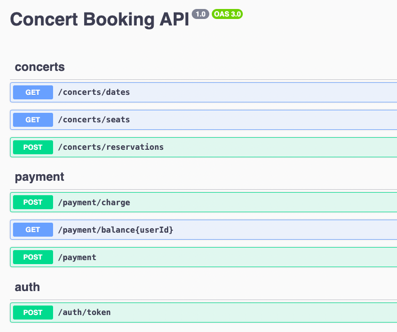

# Concert Booking Service Server

## Documentations

- [Milestone](./docs/MILESTONE.md)
- [Sequence Diagram](./docs/SEQUENCE_DIAGRAM.md)
- [ERD](./docs/ERD.md)

<!-- - [API Documentation](https://documenter.getpostman.com/view/10629292/Tz5tZ6Q7) -->

## API Spec

- [API Spec](./docs/API_SPEC.md)

  

## Description

Concert Booking Service

## Installation

```bash
$ npm install
```

## Running the app

```bash
# development
$ npm run start

# watch mode
$ npm run start:dev

# production mode
$ npm run start:prod
```

## Test

```bash
# unit tests
$ npm run test

# e2e tests
$ npm run test:e2e

# test coverage
$ npm run test:cov
```
