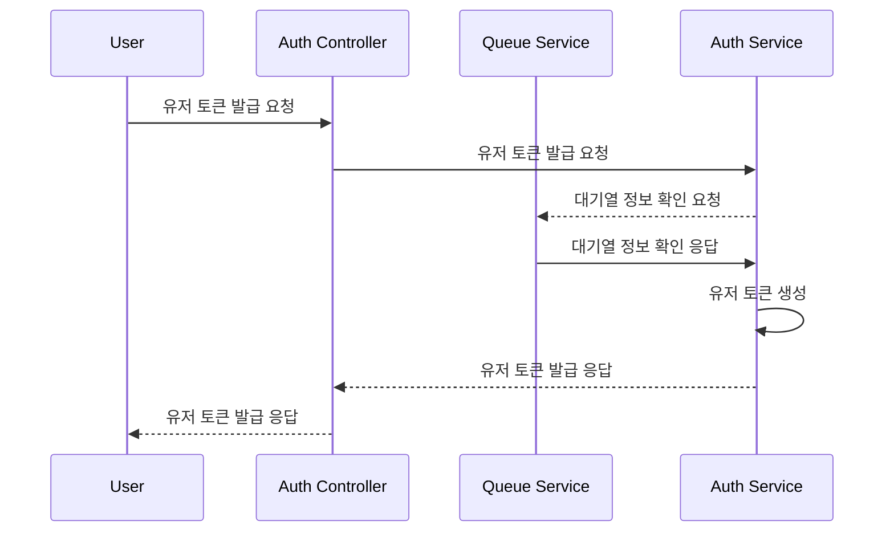
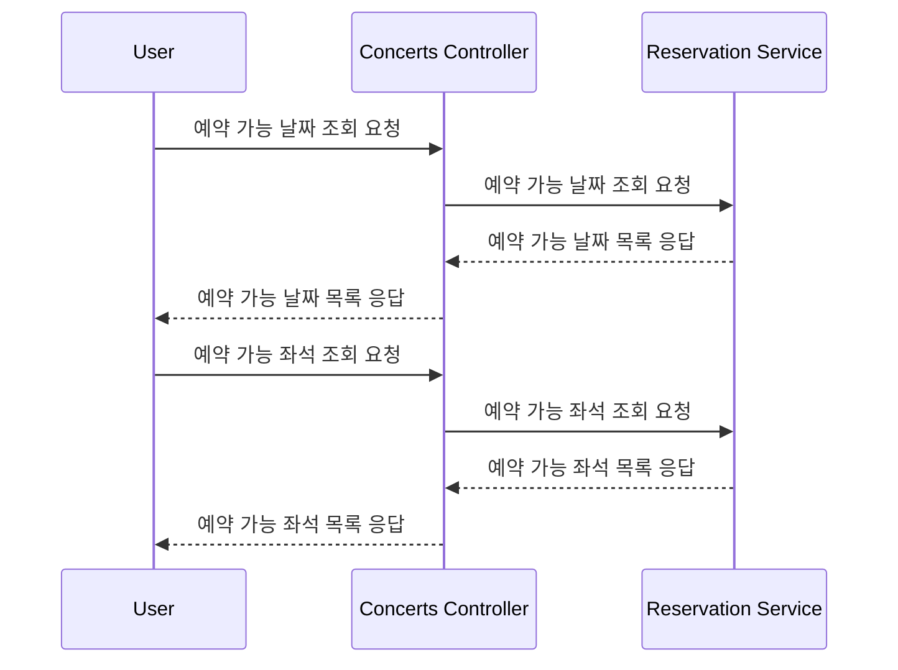
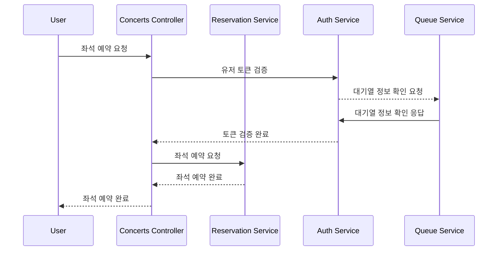
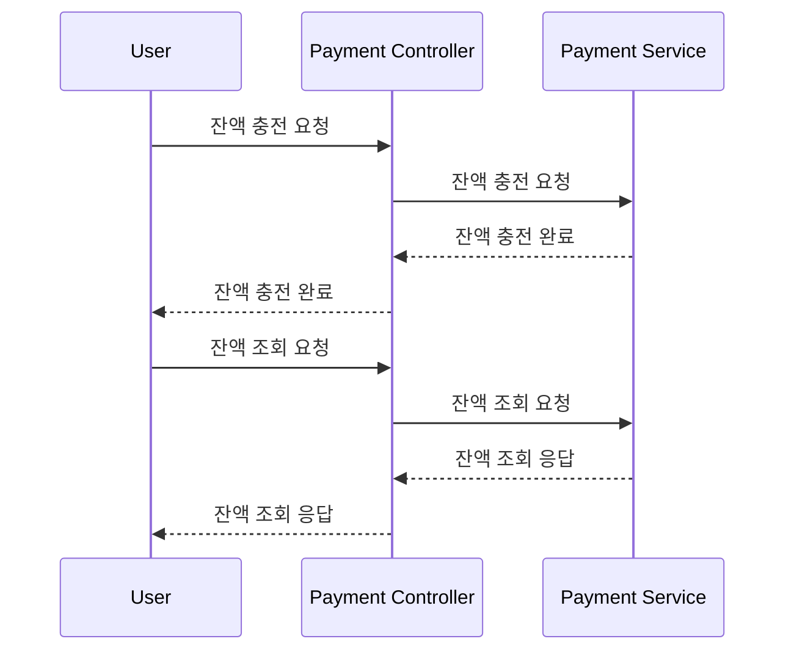
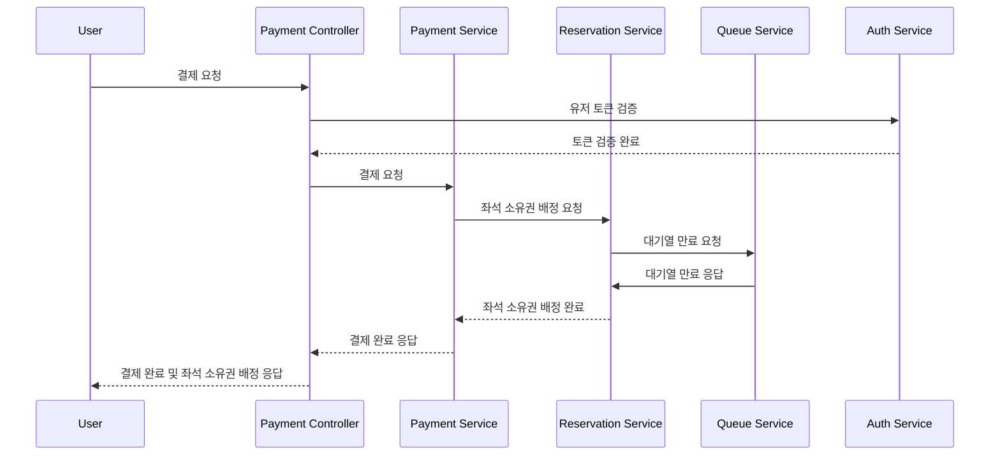

# Sequence Diagram  <!-- omit in toc -->
- [유저 토큰 발급 및 대기열 관리](#유저-토큰-발급-및-대기열-관리)
- [예약 가능 날짜 / 좌석 조회](#예약-가능-날짜--좌석-조회)
- [좌석 예약 요청](#좌석-예약-요청)
- [잔액 충전 / 조회](#잔액-충전--조회)
- [결제 처리](#결제-처리)

### 유저 토큰 발급 및 대기열 관리

### 예약 가능 날짜 / 좌석 조회
토큰으로 대기열 검증을 통과했다는 전제하에 진행

### 좌석 예약 요청

### 잔액 충전 / 조회

### 결제 처리

